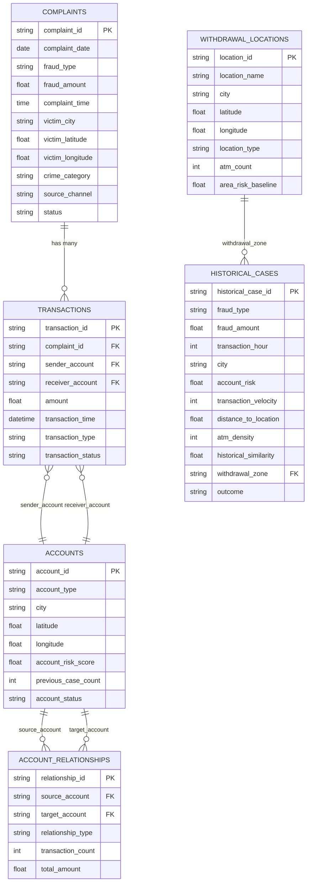
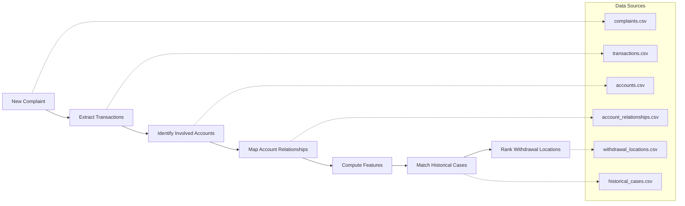
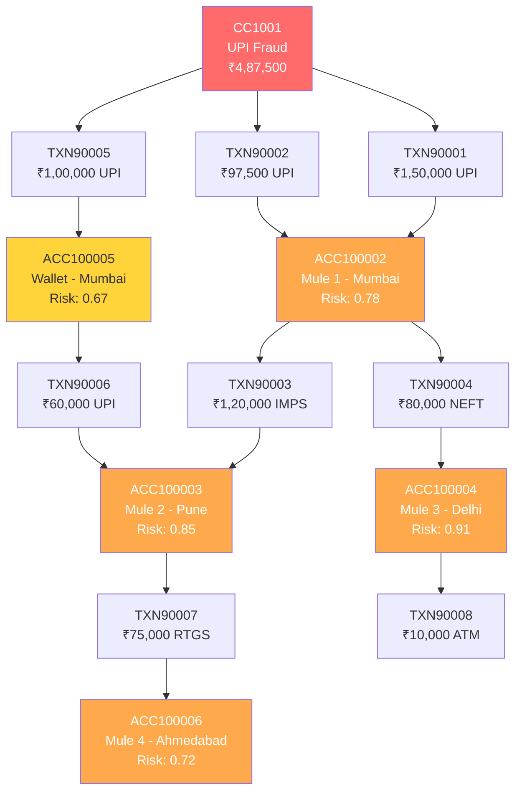

# Dataset Relationship Diagram — SYNTHETIC PROTOTYPE DATA

> **⚠ DISCLAIMER:** All data described in this document is **SYNTHETIC PROTOTYPE DATA**.
> It does NOT contain real citizen data, real bank account data, or data from any government portal.

---

## Overview

The six datasets form a connected graph that models the flow from a cybercrime complaint through financial transactions, account networks, and ultimately to candidate cash-withdrawal locations. Historical cases provide labeled training data for the future ML prediction pipeline.

---

## Entity-Relationship Diagram

---

## Relationship Descriptions

### 1. Complaints → Transactions
- **Join key:** `complaints.complaint_id` = `transactions.complaint_id`
- **Cardinality:** One complaint has many transactions (1:N)
- **Meaning:** Every cybercrime complaint is linked to one or more financial transactions that form the fraud trail.

### 2. Transactions → Accounts (Sender)
- **Join key:** `transactions.sender_account` = `accounts.account_id`
- **Cardinality:** Many transactions reference one sender account (N:1)
- **Meaning:** The account that initiated or sent the funds in each transaction.

### 3. Transactions → Accounts (Receiver)
- **Join key:** `transactions.receiver_account` = `accounts.account_id`
- **Cardinality:** Many transactions reference one receiver account (N:1)
- **Meaning:** The account that received the funds in each transaction.

### 4. Accounts → Account Relationships
- **Join keys:**
  - `account_relationships.source_account` = `accounts.account_id`
  - `account_relationships.target_account` = `accounts.account_id`
- **Cardinality:** One account can appear in many relationships (1:N on both sides)
- **Meaning:** Captures network links between accounts — mule chains, frequent transactors, shared devices, etc. These relationships are derived from transaction patterns and investigator annotations.

### 5. Withdrawal Locations → Historical Cases
- **Join key:** `historical_cases.withdrawal_zone` = `withdrawal_locations.location_id`
- **Cardinality:** One location can appear in many historical cases (1:N)
- **Meaning:** Each historical case records which withdrawal location was associated with the observed outcome.

### 6. Implicit Links (Shared Dimensions)
These columns enable cross-dataset analysis without direct foreign keys:

| Shared Dimension | Datasets | Purpose |
|---|---|---|
| `city` | complaints, accounts, withdrawal_locations, historical_cases | Geographic co-location analysis |
| `fraud_type` | complaints, historical_cases | Pattern matching across current and past cases |
| `account_risk` / `account_risk_score` | accounts, historical_cases | Risk-based feature correlation |
| `atm_density` / `atm_count` | withdrawal_locations, historical_cases | Location feature matching |

---

## Data Flow for Prediction Pipeline

### Pipeline Steps

1. **New Complaint Received** — A complaint (e.g., CC1001) enters the system.
2. **Extract Transactions** — All transactions linked to the complaint are retrieved.
3. **Identify Involved Accounts** — Sender and receiver accounts from those transactions are mapped.
4. **Map Account Relationships** — The relationship network (mule chains, shared devices, etc.) is built from the account graph.
5. **Compute Features** — Features are computed: transaction velocity, timing patterns, geographic distances, risk scores, etc.
6. **Match Historical Cases** — Feature vectors are compared against historical cases to find similar past patterns.
7. **Rank Withdrawal Locations** — Candidate withdrawal locations are scored and ranked based on the ML model's predictions.

---

## CC1001 Demonstration Case — Data Connectivity

This diagram shows how CC1001's funds flow from the victim (ACC100001) through multiple mule accounts across Mumbai, Pune, Delhi, and Ahmedabad — creating a multi-city layering pattern that the prediction pipeline must analyze to identify probable cash-withdrawal locations.
